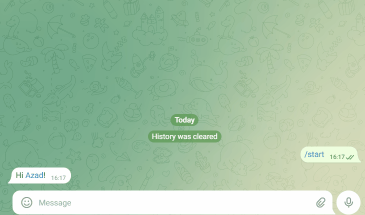
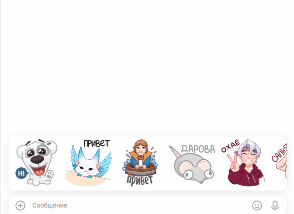

# Chatbots: Telegram + VK + Dialogflow

Проект содержит двух ботов:
- Telegram бот
- ВК бот  
Оба используют один и тот же агент Dialogflow для обработки сообщений.

## Установка
Установи зависимости:
```
pip install -r requirements.txt
```
Настрой переменные окружения в .env:
```
TG_TOKEN=токен_telegram_бота
VK_TOKEN=токен_группы_вк
DIALOGFLOW_PROJECT_ID=your-dialogflow-project-id
GOOGLE_APPLICATION_CREDENTIALS=/full/path/to/google-credentials.json
```

## Запуск ботов:
Выполнить команду в консоли:

Телеграм: 
```python tg_bot.py```

ВКонтакте: 
```python vk_bot.py```

## Демо
- Telegram-бот: https://t.me/Gamer_verbs_bot
- VK-бот: https://vk.me/club235351038



